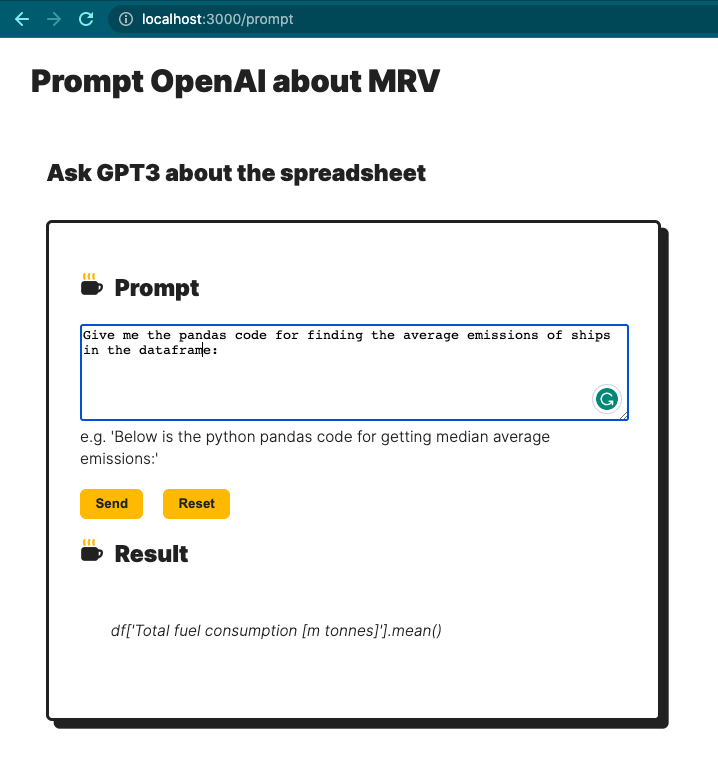
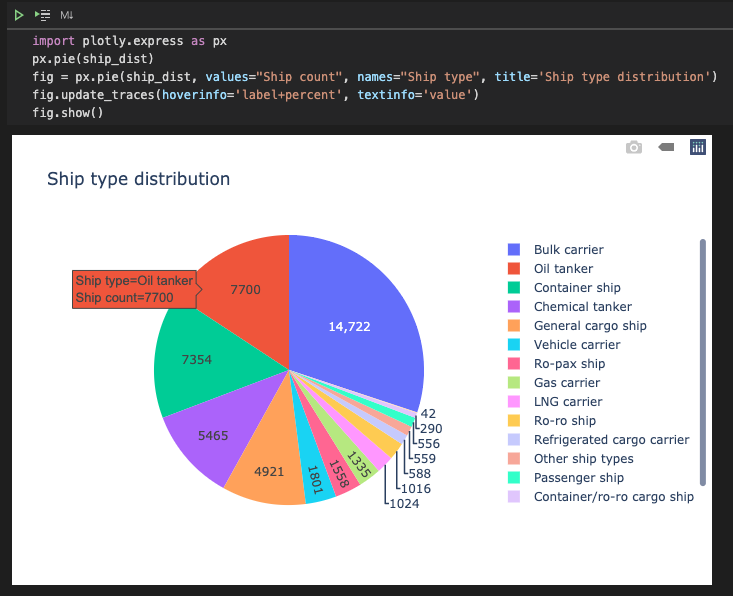
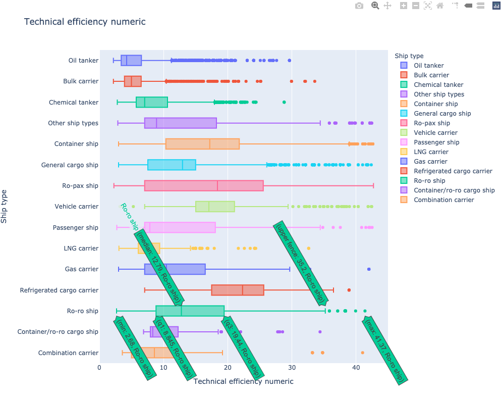
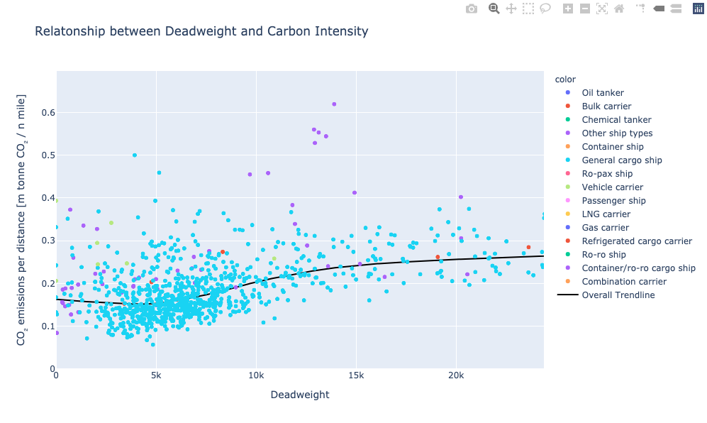
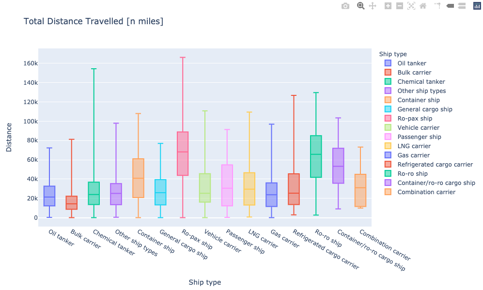

# MRV Shipping data analysis

This repo contains 2 pieces of work.
1. Jupyter Notebooks answering some data analysis questions.
2. A quick prototype of a node.js express API which serves a static webpage for gpt3 queries on the MRV data set.

## Set up for 1.
Create a virtual environment and activate it with with:

`python3 -m venv carbon-chain-venv`

`source carbon-chain-venv/bin/activate`

Install the required pip packages with:

`pip install -r reqs.txt`

Open jupyter notebooks in VSCode. Make sure the interpreter is set to the python location in your venv.

## Set up for 2.

Have the latest verion of npm and node with

`npm install -g n`

Install npm packages with

`npm install`

Follow the '.env-example' file and add openai API key in a '.env' file.

Run the app with nodemon

`npm run dev`

Go to http://localhost:3000/

## Example screenshots

